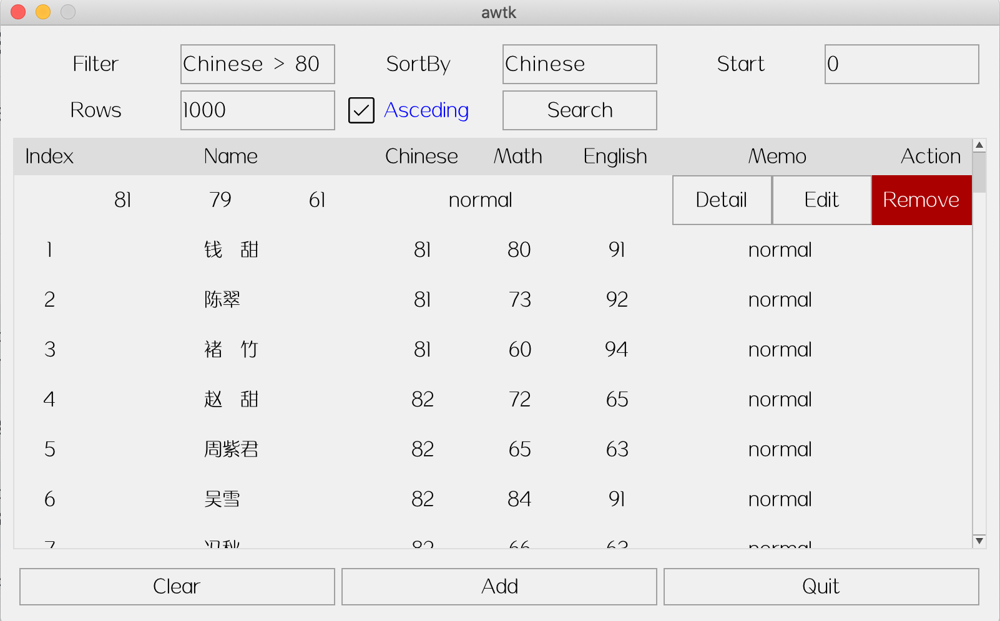

# awtk-database-repository

通过 repository 模式对关系数据库系统 (RDBMS) 的简单封装，并提供 view_model 实现，无需编写代码即可实现对数据的增删改查。

* 主界面


* 菜单



* 新建


* 修改


* 详情


## 准备

1. 获取 awtk 并编译

```
git clone https://github.com/zlgopen/awtk.git
cd awtk; scons; cd -
```

2. 获取 awtk-mvvm 并编译

```
git clone https://github.com/zlgopen/awtk-mvvm.git
cd awtk-mvvm; scons; cd -
```

3. 获取 awtk-sqlite3 并编译

```
git clone https://github.com/zlgopen/awtk-sqlite3.git
cd awtk-sqlite3; scons; cd -
```

4. 获取 awtk-widget-table-view 并编译

```
git clone https://github.com/zlgopen/awtk-widget-table-view.git
cd awtk-widget-table-view; scons; cd -
```

5. 获取 awtk-widget-table-view-mvvm 并编译

```
git clone https://github.com/zlgopen/awtk-widget-table-view-mvvm.git
cd awtk-widget-table-view-mvvm; scons; cd -
```

6. 获取 awtk-widget-slidable-row 并编译

```
git clone https://github.com/zlgopen/awtk-widget-slidable-row.git
cd awtk-widget-slidable-row; scons; cd -
```

## 运行

1. 生成示例代码的资源

```
python scripts/update_res.py all
```
> 也可以使用 Designer 打开项目，之后点击 “打包” 按钮进行生成
> 如果资源发生修改，则需要重新生成资源。

2. 编译

* 编译 PC 版本

```
scons
```

* 编译 LINUX FB 版本

```
scons LINUX_FB=true
```

> 完整编译选项请参考 [编译选项](https://github.com/zlgopen/awtk-widget-generator/blob/master/docs/build_options.md)

3. 运行

* 按传统方式使用 repository

```
bin/student_list
```

* 按 MVVM 方式使用 repository

```
bin/student_list_mvvm
```

## 参考

* [具体用法](docs/index.md)

* [awtk-mvvm](https://github.com/zlgopen/awtk-mvvm)
